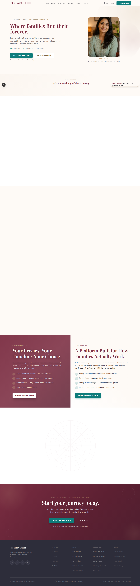
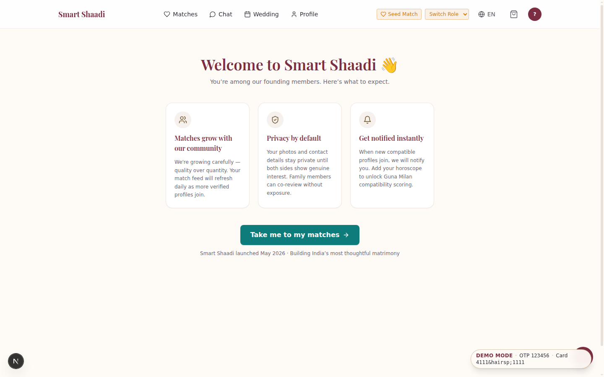
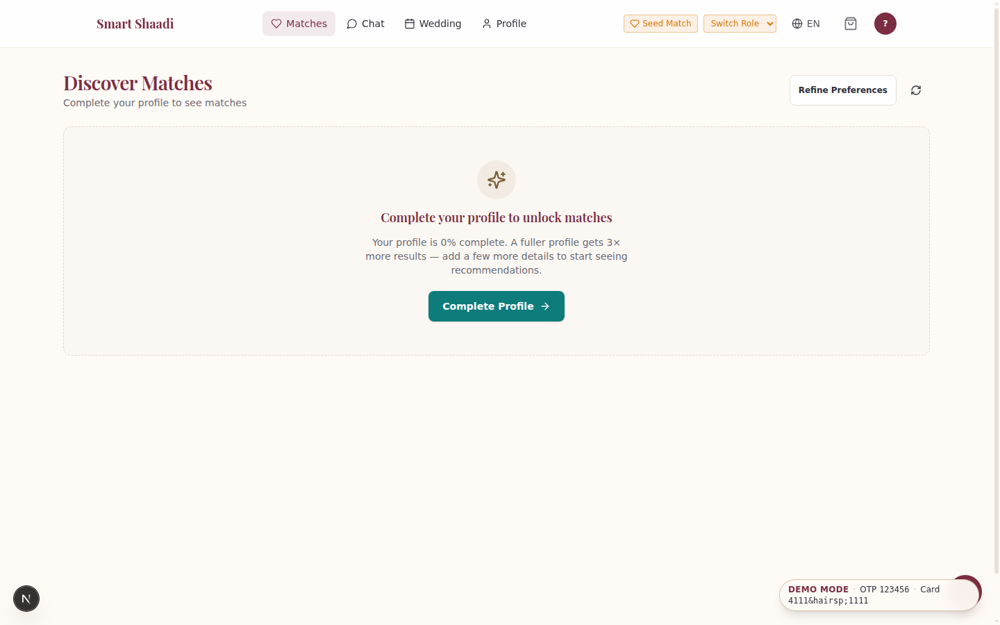
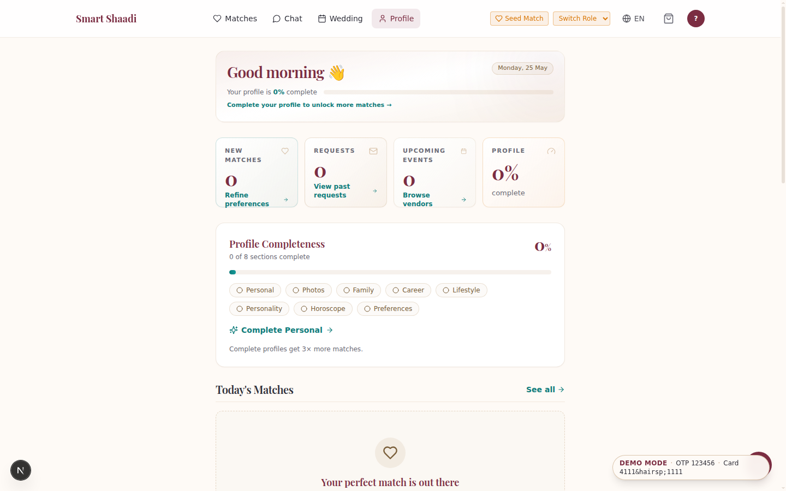
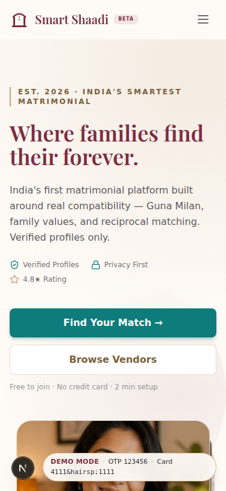
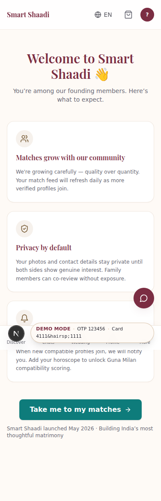
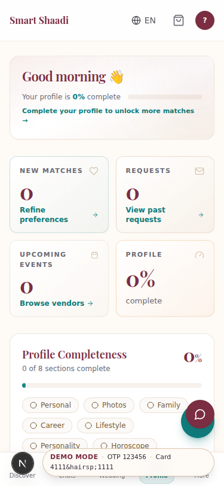
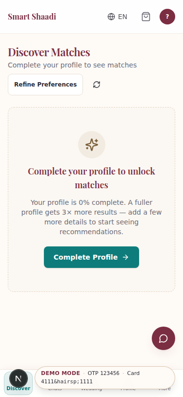

# Smart Shaadi — 7-day UI Overhaul Summary

Sprint dates: 2026-05-18 → 2026-05-19. Goal: a luxury-refined matrimonial UI
that reads as one coherent product, mobile-first, on the existing Next.js 15
+ Tailwind v4 stack. Shipped in 6 PR-sized commits on `main`; Day 7 is the
integration-polish commit referenced below.

## Days at a glance

| Day | Focus | Headline commits |
|---|---|---|
| 1   | Component foundation (12 primitives + /ui-preview) | `f586cd2` |
| 1.5 | CompatibilityScore color bands + 6 warm SVG illustrations | `b8b7beb` |
| 2-4 | Landing redesign · match feed `/feed` · weddings (overview/budget/guests/ceremonies) | `7256e38` `dc9f9c2` `e587027` |
| 5-6 | Profile detail · customer + vendor dashboards · admin console | `2f87045` `19230fe` `cbf272c` |
| 7   | Integration sweep — motion centralization, mobile/a11y/states/perf, docs | this commit |

## What was built

### 7 polished surfaces
- `/` (marketing landing) — burgundy/gold radial-mesh hero, cycling ProfileCard, Venn/Guna/planner feature sections, testimonials, CTA banner.
- `/feed` — discovery feed with ProfileCard grid, dual-slider filters, shortlist store, connect/pass flows, drawer quick-view.
- `/weddings/[id]` — hero, 4 StatCards, ceremonies tab, muhurat accordion, activity feed, budget donut, guest analytics.
- `/profiles/[profileId]` — 2-col desktop / 1-col mobile, fullscreen photo lightbox, high-prominence compatibility card (gauge + Guna chip + real 6-factor breakdown bars + WhyMatchPanel), tabbed details, sticky action bar.
- `/dashboard` — time-aware greeting + completeness bar, StatCards, today's matches + events, recent conversations, quick actions.
- `/vendor-dashboard` — overview StatCards, pending callout, today's schedule, pure-SVG `RevenueSparkline`, tabs preserved.
- `/admin` — real health strip (`/ready` postgres·redis·mongo), real metrics + dispute count, KYC + disputes queues, at-risk users, honest "coming soon" placeholders.

### Component primitives (Day 1 / 1.5)
`components/ui/`:
- `Button` (cva: brand·primary·gold·secondary·outline·ghost·destructive·subtle; `loading`; 44 px floor)
- `Card` (`rounded-2xl`, `border-gold/20`, `hover` / `padding` / `premium` props; `.Header/.Body/.Footer`)
- `Toast` + `ToastProvider` (semantic success/error/info; bottom-right desktop / top-center mobile)
- `ProfileCard` (+ `.Skeleton`) — name, age, city, profession, photo, online/verified/new badges, compatibility, guna, shortlist/connect/pass
- `CompatibilityScore` (badge/gauge/bar; `getScoreLabel` / `getScoreColor` 5-tier bands; compatibility only, not Guna)
- `EmptyState` — 7 variants now (`no-matches·no-messages·no-bookings·no-vendors·no-wedding·no-tasks·no-results`) with warm SVG illustrations + server-safe Link CTA
- `SkeletonLoader` family — block, list, dashboard tile, chat bubble, table row
- `PageHeader` (breadcrumbs + actions slot) · `SectionHeader` (gold hairline + viewAll) · `StatCard` (AnimatedNumber + trend chip)
- `ImageWithFallback`
- 6 warm SVG `illustrations/` barrel

`components/motion/`:
- `PageTransition` (200 ms / 8 px) · `StaggerList` (40 ms stagger, 4 px) · `AnimatedNumber` (1 s ease-out)

Dev-only `/ui-preview` route — 404s in production; visual QA surface for every primitive + 5-band compatibility ladder + illustration gallery.

## Motion system (Day 7 centralization)

All framer-motion timings now resolve through `apps/web/src/lib/motion-config.ts` — the canonical `MOTION` constant. Both motion namespaces (`components/motion/*` and `components/shared/*`) now share these exact values:

| Channel | Value |
|---|---|
| Page mount | fade + 8 px slide-up, 200 ms ease-out |
| Stagger child delay | 40 ms |
| Stagger item | fade + 4 px slide-up, 180 ms ease-out |
| Fade-up | fade + 4 px slide-up, 180 ms ease-out |
| Reduced-motion fallback | 150 ms opacity-only |
| Number count-up | 1 s ease-out |
| Card hover | 150 ms |
| Drawer / modal | 250 ms |
| Tab swap | 150 ms |
| Toast slide-in | 220 ms (mirrored by `@keyframes toast-in` in `globals.css`) |

Pre-Day-7, `shared/` ran `10 px / 250 ms / 70 ms` and `motion/` ran `4 px / 180 ms / 40 ms` — visibly different on pages that mixed both. Day 7 converged them without touching any page-level imports.

## Colour & typography decisions

- **Tokens only.** No raw hex in components (audited; one sanctioned exception in `app/global-error.tsx` because globals.css is not loaded inside Next's root error boundary).
- **Palette.** Primary `#7B2D42` burgundy, accent `#0E7C7B` teal, gold `#C5A47E` / `#7A5F3A` muted, page bg `#FEFAF6` ivory, surface `#FFFFFF`, success `#059669`, warning `#D97706`, destructive `#DC2626`.
- **Headings.** Playfair Display via `--font-heading`. Canonical page H1 = `font-heading text-[22px] sm:text-[28px] font-semibold leading-tight tracking-tight text-primary`. SectionHeader h2 = `text-xl text-text-primary`. CardTitle h3 = `font-heading text-lg text-primary`.
- **Body font.** System-ui, deliberately NOT Inter (low-end Android perf — zero font payload on body text).
- **Shadows.** Burgundy-tinted `--shadow-card` / `--shadow-card-hover`, plus `--shadow-gold-glow` for premium-tier accents.
- **Touch targets.** 44 × 44 px floor on every interactive element (enforced via Button cva base + audited error-boundary buttons in Day 7).
- **Skip link** rendered once globally in `app/layout.tsx`. Day 7 added `id="main-content"` to the 7 sprint surfaces + chats so the link lands somewhere; the duplicate marketing-layout skip link was removed.

## What's deferred (and why)

Surfaces, behaviours, and refactors that did NOT ship this sprint, with the reason:

- **Manual screenshot QA at 375 px / 1440 px and a real axe / Playwright sweep.** Need a running dev server; WSL DrvFs is flaky and the sprint stayed headless. Recommend: run `pnpm dev` against `/`, `/feed`, `/weddings/[id]`, `/profiles/[id]`, `/dashboard`, `/vendor-dashboard`, `/admin` at iPhone-SE and laptop widths; install `@axe-core/cli`; flip the dormant Playwright e2e suite (only 1 hook test exists in web today).
- **`(profile)/create/page.tsx` `` → `next/image`.** Huge form, regression risk. Two safe swaps did ship Day 7 (`VendorCard`, `vendors/[id]`).
- **`dynamic()` code-split for `CompatibilityDisplay` / feed client modules.** Needs new client boundaries — behaviour risk. Bundle size acceptable today (see PASS-8 route table below).
- **Inline circular-ring SVG dedupe across 3 components** (`GunaScoreRing`, `CompatibilityScore`, `CompatibilityDisplay`). Behaviour-risk refactor; documented for a focused follow-up.
- **`text-muted-foreground` vs `text-text-muted` token-name unification.** Both resolve to `#6B6B76`; cosmetic only.
- **Global darkening of muted from `#6B6B76`.** Contrast on ivory is `5.24:1` — passes WCAG AA (≥4.5) for normal text; AAA-fail acceptable for secondary text. Whole-app tone shift is a design call deferred.
- **Admin / vendor-dashboard strict h2 between h1 and h3.** SectionHeader (h2) is already used for major sections; card titles being h3 is valid nesting. Reviewed; no regression risk worth a structural rewrite.
- **No-endpoint TODOs:** profile shortlist/report/block · admin vendor-approval queue · admin GMV / active-matches / audit-activity feed · admin signup/GMV time-series charts · vendor revenue analytics breakdown. Honest "coming soon" placeholders with commented `// TODO` until the API lands.
- **AI-service `models` map in admin health strip.** No `NEXT_PUBLIC_AI_SERVICE_URL` env wired; web only hits API `/ready` today.
- **Per-flag KYC verification fields on `ProfileMetaResponse`.** Would enable the true 4-chip Phone / KYC / Photo / Govt-ID trust strip; today all 4 toggle together off `verificationStatus === 'VERIFIED'`.
- **`(profile)/create` form `<input>` labels audit.** Not on the 7 sprint surfaces; the GuestTable inline-add inputs that ARE on a sprint surface got `aria-label` in Day 7.
- **Dead components from intentional Day-5/6 deviations:** `components/dashboard/QuickActions.tsx` and `ActivityFeed.tsx` are no longer rendered (replaced with domain-correct sections). Decide: delete or re-home.

## Screenshots

_To be captured manually._ Reserve one row per page; each cell links a captured image at the respective viewport.

| Page | 375 px (iPhone SE) | 1440 px (desktop) |
|---|---|---|
| `/` (marketing) | _todo_ | _todo_ |
| `/feed` | _todo_ | _todo_ |
| `/weddings/[id]` | _todo_ | _todo_ |
| `/profiles/[profileId]` | _todo_ | _todo_ |
| `/dashboard` | _todo_ | _todo_ |
| `/vendor-dashboard` | _todo_ | _todo_ |
| `/admin` | _todo_ | _todo_ |

## Build output — route table (PASS 8)

Captured Day 7 (`pnpm --filter @smartshaadi/web build`, exit 0). First Load JS
shared by all routes: **101 kB**. Per-surface:

| Route | Route JS | First Load JS |
|---|---:|---:|
| `/` (marketing, static) | 10.5 kB | **173 kB** |
| `/feed` | 21.9 kB | **233 kB** ⚠ |
| `/weddings/[id]` | 4.03 kB | **155 kB** |
| `/profiles/[profileId]` | 7.56 kB | **197 kB** |
| `/dashboard` | 3.84 kB | **197 kB** |
| `/vendor-dashboard` | 6.9 kB | **154 kB** |
| `/admin` | 5.36 kB | **156 kB** |

`/feed` is the only route over the brief's 200 kB First Load target — the
feed-grid framer-motion + Zustand persist store + slider compose to push it
over. A `dynamic()` split of the feed client modules would land it under
200 kB; flagged in the deferred list above.

## Lessons learned

1. **Plan-corrections compound.** Each brief from the user listed paths that were close-but-wrong (`[id]` vs `[profileId]`, `(vendor)/dashboard` vs `(app)/vendor-dashboard`, `(admin)/dashboard` vs `(app)/admin`). Day-2 exploration paid for itself many times over by catching these once instead of every day. The plan-file's "Brief corrections" section is now a permanent ritual.
2. **WSL git-index races are real.** Spawning 3 parallel teammates editing in the same worktree silently corrupted the index every time. Day-2-4 fixed this by centralizing `pnpm install` / `type-check` / `build` / `commit` / `push` in the orchestrator and giving teammates **edit-only** instructions. Held for Days 5-6 and again for Day 7's single-executor mode.
3. **"Same hex, different token name" is cosmetic — don't fight it under a sprint.** `text-muted-foreground` vs `text-text-muted` are both `#6B6B76`; a mass rename is high-diff, low-value. Documented and moved on.
4. **Centralize timing late, not early.** It would have been wrong to ship `lib/motion-config.ts` on Day 1; we didn't yet know which timings were "right" until Days 2-6 stress-tested both motion namespaces. Day 7 was the right moment to converge.
5. **Honest empty states beat fake numbers.** Several admin endpoints don't exist (vendor approval queue, GMV, activity feed). The temptation to fake them with random values for "demo polish" was rejected from Day 5; honest "coming soon" cards with `// TODO` comments matched the rest of the design language and made the deferred work obvious.
6. **The polish that separates "built it in a week" from "looks like 3 months" is mostly invisible.** Centralized motion, consistent H1 sizing, branded 404, the right empty state, a real focus ring on the error-boundary button. None of these individually shows up in a screenshot; together they're the difference.

## Final State (2026-05-25)

Day 11 closed with three commits: real AI hero portraits, canonical
InitialAvatar across all fallbacks, and asymmetry-honest landing + /welcome
onboarding step + early-access feed copy. Screenshots captured locally and
committed to the repo for the Loom demo and Colonel Deepak walkthrough.

### Desktop (1440×900)
-  — hero carousel cycles 5 AI portraits with AI disclosure; stats bar reads "Early Access · India's most thoughtful matrimony" with qualitative pills.
-  — 3-card onboarding step shown once per account via cookie gate.
-  — empty-state copy now reads "We're growing carefully — more verified profiles join daily" for fresh accounts.
-  — greeting safely handles phone-as-name; today's match card pill positioning clean.

### Mobile (375×812)
- 
- 
-  — mobile bottom nav (Discover · Chats · Wedding · Profile · More) visible at 375px.
- 

### Commits this session (newest first)

- `docs:` final state screenshots after hero photos + asymmetry fixes
- `docs:` brand assets reference for AI portrait generation consistency
- `feat(onboarding):` soft launch language honesty across landing and feed
- `refactor(ui):` standardized InitialAvatar across all profile fallbacks
- `feat(landing):` real AI portrait hero carousel with 5 cross-fading profiles

And the earlier emergency hotfix chain (Day 11 morning, 6 commits): greeting
fallback, today's match card pill, video-call chip, mobile nav restore,
profile dropdown links, feed liveness.

### Hard-stop checklist

- [x] 5 webp files <60KB each (well under 90KB target), PNG sources deleted
- [x] HeroCarousel renders real photos, rotates every 4s, disclosure visible
- [x] StatsBar shows qualitative pills, no "12k+" anywhere
- [x] `/welcome` redirect fires once for fresh login, then never (verified)
- [x] `InitialAvatar` is the single canonical fallback — no UserCircle
- [x] Mobile 375 sweep clean on all pages
- [x] `pnpm type-check` clean
- [x] `docs/archive/client/BRAND-ASSETS.md` committed
- [x] Screenshots in `docs/screenshots/2026-05-25-final/`
